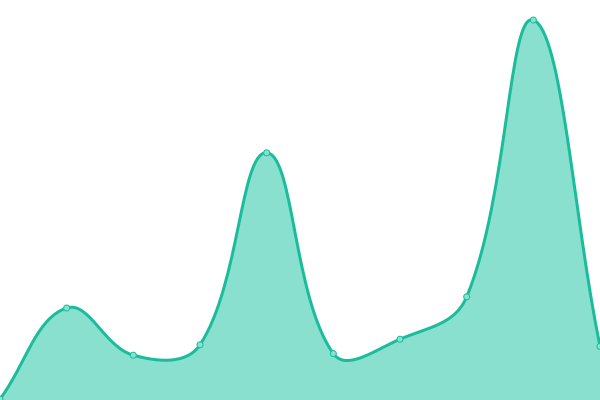
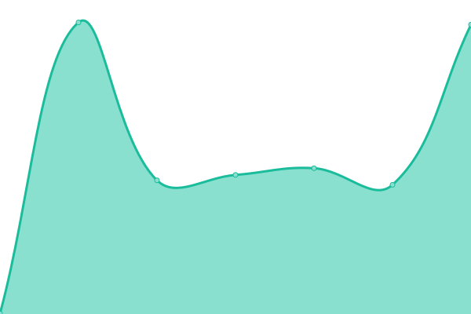
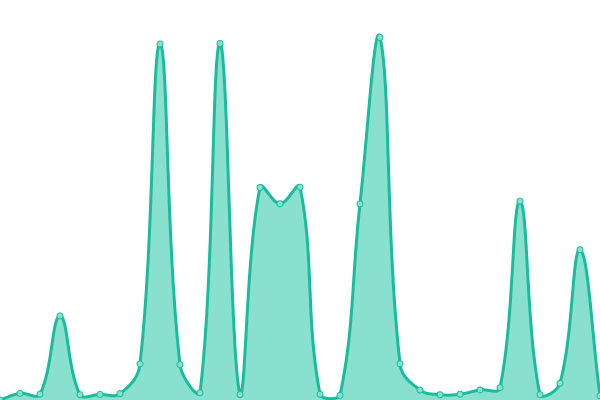
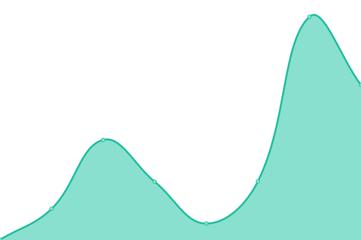

# [📈 Live Status](https://larrikin-coder.github.io/upptime): <!--live status--> **🟧 Partial outage**

This repository contains the open-source uptime monitor and status page for [Shaurya Thapliyal](https://larrikin-coder.github.io/upptime), powered by [Upptime](https://github.com/upptime/upptime).

With [Upptime](https://upptime.js.org), you can get your own unlimited and free uptime monitor and status page, powered entirely by a GitHub repository. We use [Issues](https://github.com/larrikin-coder/upptime/issues) as incident reports, [Actions](https://github.com/larrikin-coder/upptime/actions) as uptime monitors, and [Pages](https://larrikin-coder.github.io/upptime) for the status page.

<!--start: status pages-->
<!-- This summary is generated by Upptime (https://github.com/upptime/upptime) -->
<!-- Do not edit this manually, your changes will be overwritten -->
<!-- prettier-ignore -->
| URL | Status | History | Response Time | Uptime |
| --- | ------ | ------- | ------------- | ------ |
|  [Portfolio-Website-Fe](https://portfolio-website-rho-sand.vercel.app) | 🟩 Up | [portfolio-website-fe.yml](https://github.com/larrikin-coder/upptime/commits/HEAD/history/portfolio-website-fe.yml) | 

 126ms
     
 | 

<a href="https://larrikin-coder.github.io/upptime/history/portfolio-website-fe">100.00%</a>
    

|  [Portfolio-Website-Be](https://portfolio-website-tdvz.onrender.com) | 🟥 Down | [portfolio-website-be.yml](https://github.com/larrikin-coder/upptime/commits/HEAD/history/portfolio-website-be.yml) | 

 446ms
     
 | 

<a href="https://larrikin-coder.github.io/upptime/history/portfolio-website-be">100.00%</a>
    

|  [Excel-LLM-Fe](https://excel-mcp-b7mo.onrender.com) | 🟩 Up | [excel-llm-fe.yml](https://github.com/larrikin-coder/upptime/commits/HEAD/history/excel-llm-fe.yml) | 

 5326ms
     
 | 

<a href="https://larrikin-coder.github.io/upptime/history/excel-llm-fe">94.19%</a>
    

|  [Excel-LLM-Be](https://excel-mcp-server-34g5.onrender.com) | 🟥 Down | [excel-llm-be.yml](https://github.com/larrikin-coder/upptime/commits/HEAD/history/excel-llm-be.yml) | 

 7762ms
     
 | 

<a href="https://larrikin-coder.github.io/upptime/history/excel-llm-be">100.00%</a>
    

|  [SeedheAuth-Docs](https://seedheauth.netlify.app) | 🟩 Up | [seedhe-auth-docs.yml](https://github.com/larrikin-coder/upptime/commits/HEAD/history/seedhe-auth-docs.yml) | 

 169ms
     
 | 

<a href="https://larrikin-coder.github.io/upptime/history/seedhe-auth-docs">100.00%</a>
    

<!--end: status pages-->

[**Visit our status website →**](https://larrikin-coder.github.io/upptime)

## 📄 License

- Powered by: [Upptime](https://github.com/upptime/upptime)
- Code: [MIT](./LICENSE)
